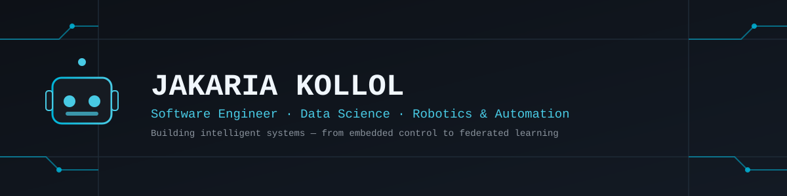

<div align="center">



<br/><br/>

<a href="https://www.linkedin.com/in/jakaria-kollol">
  
</a>
<a href="mailto:jakariakollol9@gmail.com">
  
</a>
<a href="https://github.com/jkollol">
  
</a>

<br/><br/>


</div>

<br/>

## 🧑‍💻 About Me

```yaml
name: Jakaria Kollol
role: Software Engineering Undergraduate (Data Science)
university: Daffodil International University, Dhaka
interests: [Data Science, Robotics & Embedded Systems, Federated Learning, Web Development]
fun_fact: "I taught a plant-watering robot to follow Bluetooth commands 🌱🤖"
```

- 🔭 Currently working on **Quantum-Augmented TrustGraph-FRL** — a federated graph learning framework for adaptive APT defense
- 💻 Comfortable across the stack: embedded control, backend web development, and data-driven systems
- 🤝 Enjoy collaborative, feedback-driven engineering work
- 🗣️ English · Bengali (native) · Chinese (HSK 1 & 2)

<br/>

## 🛠️ Tech Stack

<div align="center">

</div>

<br/>

## 🚀 Featured Projects

<div align="center">

<a href="https://github.com/jkollol/Remote-Controlled-Plant-Watering-Robot">

</a>
<a href="https://github.com/jkollol/Zmart">

</a>

</div>

**🌱 Remote-Controlled Plant Watering Robot** — Arduino Nano + HC-05 Bluetooth + L298N H-Bridge automation for smart gardening.

**🛒 Z-mart** — Full-stack Laravel eCommerce platform with authentication, CRUD, Eloquent relationships & middleware.

**🔬 Quantum-Augmented TrustGraph-FRL** *(ongoing research)* — Federated graph learning + quantum reinforcement learning for adaptive Advanced Persistent Threat defense. Awarded CAD 6,000 in research funding.

<br/>

## 📊 GitHub Stats

<div align="center">


</div>

<div align="center">

</div>

<br/>

## 🎓 Education

| Degree | Institution | Year | Result |
|---|---|---|---|
| BSc. Software Engineering (Data Science) | Daffodil International University | 2022 – 2026 | CGPA 3.68 |
| Higher Secondary Certificate (HSC) | Biam Model School and College, Bogura | 2019 | GPA 5.00 |
| Secondary School Certificate (SSC) | Bogura Zilla School, Bogura | 2017 | GPA 5.00 |

<br/>

<div align="center">

### 📫 Let's Connect

<a href="https://www.linkedin.com/in/jakaria-kollol"></a>
<a href="mailto:jakariakollol9@gmail.com"></a>

</div>
